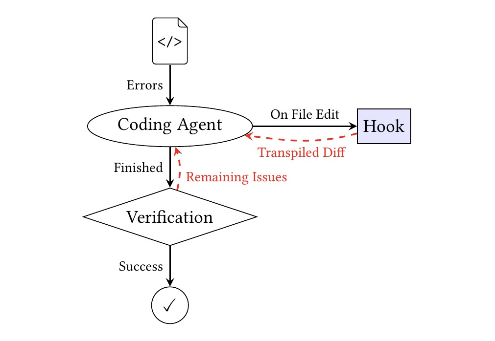

# AgenticTyper

An LLM-based agentic system for automatically adding type annotations to legacy JavaScript and TypeScript codebases.

[](https://doi.org/10.5281/zenodo.17954447)

## Key Principle: No Runtime Changes

AgenticTyper only adds type annotations—it never modifies runtime behavior. This is verified through **transpilation comparison**: after each edit, a hook transpiles the modified code and compares it against the original JavaScript output. Any behavioral difference is immediately flagged to the agent.

When errors cannot be fixed without behavioral changes, the system inserts suppression comments annotated as either:

- **Bugs**: `@ts-expect-error BUG ...` — semantic issues requiring developer attention
- **Valid untyped code**: `@ts-expect-error ...` — patterns like intentional type coercion that work correctly but cannot be typed

Bugs can be easily found by searching for `@ts-expect-error BUG` in the codebase. This keeps issues visible while establishing a clean type-checked baseline.

## Three-Phase Approach

### Phase 0: Analysis

Detects the project's language (JavaScript/TypeScript) and Node.js version to configure subsequent phases.

### Phase 1: Minimal Setup (Zero Errors Baseline)

Establishes TypeScript checking and eliminates all type errors:

1. Enable TypeScript configuration
2. Install missing `@types` packages
3. Fix or suppress all type errors

Result: Zero type errors with no runtime changes.

### Phase 2: Full Coverage (No Any)

Adds explicit type annotations throughout the codebase:

1. Enable `noImplicitAny` (+ ESLint `@typescript-eslint/no-explicit-any` for TypeScript projects)
2. Add type definitions and annotations
3. Address newly revealed errors

Target: Complete type coverage with no implicit or explicit `any` types.

## Feedback Loop



The system operates in a continuous feedback loop:

1. **Error Analysis**: Agent receives type errors from the TypeScript compiler
2. **Edit Hook**: Each file edit triggers transpilation comparison—if the JavaScript output differs from the original, the agent is alerted
3. **Verification**: After the agent finishes, remaining issues are checked and fed back if necessary
4. **Completion**: Phase succeeds when all errors are resolved without behavioral changes

This ensures type safety improvements without risking regressions in legacy code that may lack tests.

## Technology

Built with the [Claude Agent SDK](https://docs.anthropic.com/en/docs/claude-code/sdk) in TypeScript (`@anthropic-ai/claude-agent-sdk`), which provides programmatic access to Claude Code's agentic capabilities including file operations, tool use, and iterative problem-solving.

## Usage

```bash
npm install
npm start <project-path>
```

Run repeatedly to progress through phases.

### Verify Behavioral Equivalence

```bash
node scripts/compare-transpiled.ts <project-path> <previous-git-ref>
# Example:
node scripts/compare-transpiled.ts ../my-legacy-project development
```
